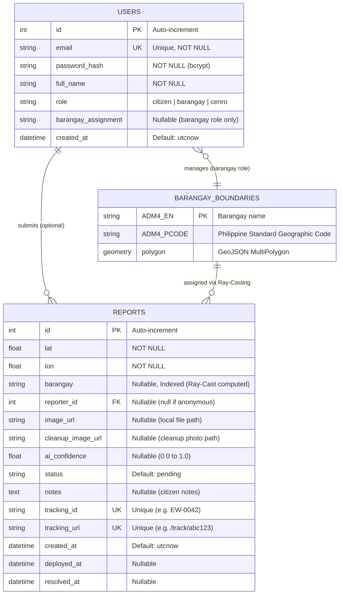
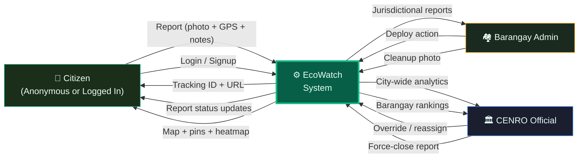
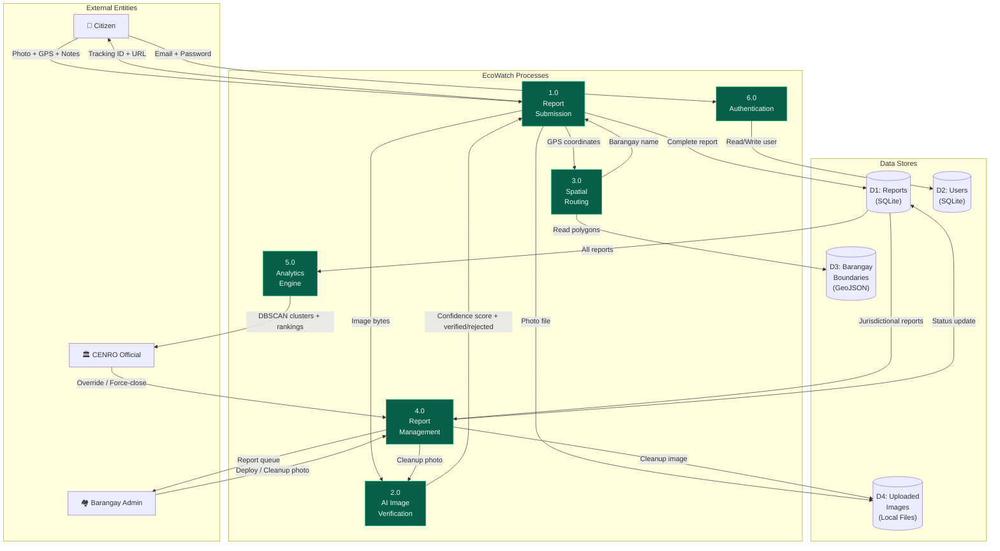

# EcoWatch SJDM — ERD & Data Flow Diagrams

---

## 1. Entity Relationship Diagram (ERD)



### Relationship Descriptions

| Relationship | Type | Description |
|:-------------|:-----|:------------|
| `USERS → REPORTS` | One-to-Many (optional) | A user can submit many reports. Anonymous reports have `reporter_id = NULL`. |
| `BARANGAY_BOUNDARIES → REPORTS` | One-to-Many | Each report is assigned to one barangay via Ray-Casting algorithm. |
| `USERS → BARANGAY_BOUNDARIES` | Many-to-One (optional) | A barangay admin is assigned to manage one specific barangay via `barangay_assignment`. |

### Entity Summary

| Entity | Storage | Record Count |
|:-------|:--------|:-------------|
| `USERS` | SQLite (`ecowatch.db`) | Grows with signups |
| `REPORTS` | SQLite (`ecowatch.db`) | Grows with submissions |
| `BARANGAY_BOUNDARIES` | GeoJSON file (`data/sjdm_barangays.geojson`) | Fixed — 59 barangays in SJDM |

---

## 2. Data Flow Diagram (DFD)

### Level 0 — Context Diagram



### Level 1 — System Decomposition



### Process Descriptions

| Process | Name | Input | Output | Description |
|:--------|:-----|:------|:-------|:------------|
| 1.0 | Report Submission | Photo, GPS, Notes | Tracking ID, URL | Citizen uploads photo + GPS. System orchestrates AI verification and spatial routing, then saves complete report. |
| 2.0 | AI Image Verification | Image bytes | Confidence score, Verified/Rejected | Mask R-CNN analyzes the photo for illegal waste. Returns confidence score (0.0–1.0). `[MOCK for now]` |
| 3.0 | Spatial Routing | Latitude, Longitude | Barangay name | Ray-Casting (Point-in-Polygon) algorithm checks GPS coords against 59 barangay polygons to determine jurisdiction. |
| 4.0 | Report Management | Status changes, Cleanup photos | Updated report | Barangay deploys sweepers, uploads cleanup photo. CENRO overrides/reassigns. AI re-verifies cleanup photos. |
| 5.0 | Analytics Engine | All reports | DBSCAN clusters, Rankings | Runs DBSCAN clustering on report coordinates to detect hotspots. Calculates barangay resolution rates for compliance ranking. |
| 6.0 | Authentication | Email, Password | User session, Role | Local auth via SQLite `users` table. Returns user role for route-based access control. |

### Data Store Descriptions

| Store | Name | Format | Description |
|:------|:-----|:-------|:------------|
| D1 | Reports | SQLite table | All submitted reports with status, coordinates, AI results, timestamps |
| D2 | Users | SQLite table | User accounts with email, hashed password, role, barangay assignment |
| D3 | Barangay Boundaries | GeoJSON file | 59 barangay polygon geometries for SJDM — used by Ray-Casting |
| D4 | Uploaded Images | Local file system | Report photos and cleanup verification photos stored in `backend/uploads/` |

---

## 3. Report Data Flow (End-to-End)

This shows the complete journey of a single report through the system:

```
CITIZEN                     SYSTEM                          DATA STORES
───────                     ──────                          ───────────

1. Takes photo          ──▶ Receives photo + GPS
   + GPS captured           │
                            ▼
                        2. AI Verification (P2)
                           Mask R-CNN analyzes
                            │
                       ┌────┴────┐
                       ▼         ▼
                   VERIFIED   REJECTED ──▶ Saved to D1
                       │                   status="rejected"
                       ▼                   (DEAD END)
                    3. Spatial Routing (P3)
                       Ray-Cast GPS against
                       D3 (GeoJSON polygons)
                            │
                            ▼
                       Barangay identified
                            │
                            ▼
                    4. Report saved ─────────▶ D1 (Reports table)
                       status="verified"       D4 (Photo file)
                            │
◀── Tracking ID + URL ─────┘

────────── CITIZEN DONE, BARANGAY TAKES OVER ──────────

BARANGAY ADMIN              SYSTEM                          DATA STORES
──────────────              ──────                          ───────────

5. Sees report in      ◀── Fetches from D1 where
   their queue              barangay = their assignment
        │
        ▼
6. Clicks [Deploy]     ──▶ Status → "deployed" ──────────▶ D1 updated
                            deployed_at = now()
        │
        ▼
7. Cleans the site
   Takes "after" photo
        │
        ▼
8. Uploads cleanup     ──▶ AI re-verifies (P2) ──────────▶ D4 (cleanup photo)
   photo                    │
                       ┌────┴────┐
                       ▼         ▼
                   RESOLVED   FAILED_CLEANUP
                       │         │
                       ▼         ▼
                   D1 updated  D1 updated
                   status=     status=
                   "resolved"  "failed_cleanup"
                   resolved_at (retry needed)
                   = now()

────────── CENRO MONITORS EVERYTHING ──────────

CENRO OFFICIAL              SYSTEM                          DATA STORES
──────────────              ──────                          ───────────

9. Views dashboard     ◀── Analytics Engine (P5)
   - City map               DBSCAN on D1 → hotspots
   - Hotspots                Resolution rates → rankings
   - Rankings
   - Charts

10. Override actions:
    - Reassign report  ──▶ D1: barangay = new_value
    - Force-close      ──▶ D1: status = "resolved"
```
