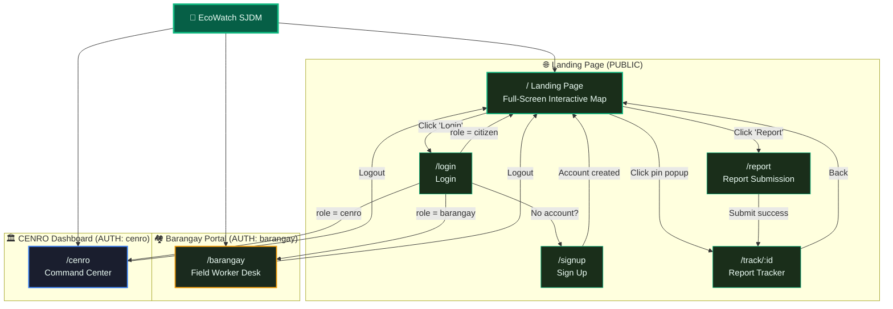

# 🗺️ EcoWatch SJDM — Final Sitemap

---

## System Overview



---

## Page Inventory

| # | Route | Page Name | Access | Entry Point |
|:--|:------|:----------|:-------|:------------|
| 1 | `/` | Landing Page | 🌐 Public | Direct URL, QR scan, default home |
| 2 | `/report` | Report Submission | 🌐 Public | Landing page "Report" button, QR code scan |
| 3 | `/track/:id` | Report Tracker | 🌐 Public | After submission, pin popup link, shared URL |
| 4 | `/login` | Login | 🌐 Public | Landing page "Login" button |
| 5 | `/signup` | Sign Up | 🌐 Public | Login page "Create account" link |
| 6 | `/barangay` | Barangay Portal | 🔒 `barangay` role | Login redirect |
| 7 | `/cenro` | CENRO Dashboard | 🔒 `cenro` role | Login redirect |

**Internal routes (no user navigation):**
| Route | Purpose |
|:------|:--------|
| `/api/chat` | Gemini AI chat endpoint |
| `/auth/callback` | Supabase OAuth callback handler |

---

## Page-by-Page Feature Inventory

### Page 1: Landing Page — `/` (PUBLIC)

> The public-facing hub. Map-first, action-oriented.

```
┌──────────────────────────────────────────────────────────────┐
│  🌿 EcoWatch SJDM             [Report] [QR Code] [Login]    │
├──────────────────────────────────────────────────────────────┤
│                                                              │
│  ┌─── FULL-SCREEN MAP ──────────────────────────────────┐   │
│  │                                                       │   │
│  │   • Barangay polygon boundaries (clickable)           │   │
│  │   • Report pins: 🔴 Pending 🟡 Deployed 🟢 Resolved  │   │
│  │   • Heatmap density overlay (DBSCAN clusters)         │   │
│  │   • Zoom / Pan controls                               │   │
│  │                                                       │   │
│  │   INTERACTIONS:                                       │   │
│  │   • Click a BARANGAY POLYGON → map zooms into that    │   │
│  │     barangay, shows only its reports                   │   │
│  │   • Click a REPORT PIN → popup bubble:                │   │
│  │     [Photo] [Status] [Barangay] [Timestamp]           │   │
│  │     [View Full Report →]                              │   │
│  │                                                       │   │
│  └───────────────────────────────────────────────────────┘   │
│                                                              │
│  ┌── SIDE PANEL (collapsible) ───┐                          │
│  │  📋 Live Report Feed          │                          │
│  │  ─────────────────────────    │                          │
│  │  🔴 Illegal dump - Muzon     │                          │
│  │     2 min ago                 │                          │
│  │  🟡 Deployed - Sapang Palay  │                          │
│  │     15 min ago                │                          │
│  │  🟢 Resolved - Tungko        │                          │
│  │     1 hr ago                  │                          │
│  └───────────────────────────────┘                          │
│                                                              │
│  💬 AI Chat (bottom-right floating bubble)                   │
└──────────────────────────────────────────────────────────────┘
```

| Feature | Description |
|:--------|:------------|
| Interactive map | Full-screen Leaflet map of SJDM with barangay polygons, report pins, heatmap |
| Barangay click-to-zoom | Click any barangay polygon → zooms in, filters to that area's reports |
| Pin popup | Click a pin → popup with photo, status, barangay, timestamp, link to `/track/:id` |
| Live report feed | Collapsible side panel showing recent reports in real-time, scrollable |
| Report button | Navbar button → navigates to `/report` |
| QR Code button | Generates a printable/saveable QR code linking to `/report` for physical display |
| Login button | Navbar button → navigates to `/login` |
| AI Chat | Floating chat bubble (EcoWatch Guide via Gemini) |

---

### Page 2: Report Submission — `/report` (PUBLIC)

> Mobile-first camera upload. Anonymous or logged-in.

| Feature | Description |
|:--------|:------------|
| GPS capture | W3C Geolocation API triggers on page load |
| Photo upload | Camera capture or gallery select |
| Notes field | Optional text description |
| Submit | Sends to backend → AI verifies → Ray-Cast assigns barangay |
| Result screen | Shows: AI verdict, assigned barangay, **Report ID** (e.g., `EW-0042`), **Tracking URL**, share button |

---

### Page 3: Report Tracker — `/track/:id` (PUBLIC)

> Shareable status page for any report.

| Feature | Description |
|:--------|:------------|
| Report ID display | `EW-0042` prominently shown |
| Status timeline | Visual progress: `Pending → Verified → Deployed → Resolved` with active step highlighted |
| Report photo | Original submitted photo |
| Location mini-map | Small map showing the pin location |
| Barangay assigned | Which barangay is responsible |
| Timestamps | When submitted, when deployed, when resolved |
| Share button | Copy tracking URL to clipboard |

---

### Page 4: Login — `/login` (PUBLIC)

| Feature | Description |
|:--------|:------------|
| Email + Password form | Standard login via Supabase Auth |
| Role-based redirect | `citizen` → `/`, `barangay` → `/barangay`, `cenro` → `/cenro` |
| Sign up link | "No account?" → navigates to `/signup` |
| Error handling | Invalid credentials → inline error message |

---

### Page 5: Sign Up — `/signup` (PUBLIC)

| Feature | Description |
|:--------|:------------|
| Registration form | Name, email, password |
| Default role | All new accounts are `citizen`. Barangay/CENRO accounts created by admin. |
| Success | Account created → redirect to `/` (landing) |

---

### Page 6: Barangay Portal — `/barangay` (AUTH: `barangay` role)

> The field worker's desk. Simple, action-oriented.

```
┌──────────────────────────────────────────────────────────────┐
│  🏘️ Barangay [Name] Portal      [Pending: 8] [Resolved: 42]│
├──────────────────────────────────────────────────────────────┤
│                                                              │
│  ┌─── REPORT QUEUE (left 60%) ──┐ ┌── MAP (right 40%) ───┐ │
│  │                               │ │                       │ │
│  │  [Pending] [Deployed] [Done]  │ │  Zoomed to own        │ │
│  │  ────────────────────────     │ │  barangay polygon      │ │
│  │                               │ │                       │ │
│  │  🔴 Illegal dump - River Rd  │ │  🔴 = Pending         │ │
│  │     📷 [Photo] 📍 [Location]  │ │  🟡 = Deployed        │ │
│  │     👤 Anonymous | 2hrs ago   │ │  🟢 = Resolved        │ │
│  │     [🚛 Deploy Sweepers]     │ │                       │ │
│  │                               │ │  Click pin → details  │ │
│  │  🟡 Block 4 cleanup ongoing  │ │                       │ │
│  │     📷 [Photo] 📍 [Location]  │ │                       │ │
│  │     Deployed 3hrs ago         │ │                       │ │
│  │     [📸 Upload Cleanup Photo]│ │                       │ │
│  │                               │ │                       │ │
│  └───────────────────────────────┘ └───────────────────────┘ │
└──────────────────────────────────────────────────────────────┘
```

| Feature | Description |
|:--------|:------------|
| Report queue | Scrollable list of reports in their jurisdiction, tab-filtered by status |
| Report card details | Photo thumbnail, GPS location, timestamp, reporter info (or "Anonymous"), citizen notes |
| Jurisdictional map | Leaflet map locked/zoomed to their barangay polygon, showing only their pins |
| Deploy button | Changes report status to `deployed` (simple status change) |
| Cleanup upload | Upload "after" photo → AI re-verifies → `resolved` or `failed_cleanup` |
| Stats bar | Pending count, Deployed count, Resolved count |

---

### Page 7: CENRO Dashboard — `/cenro` (AUTH: `cenro` role)

> The command center. Monitor, analyze, hold accountable.

```
┌──────────────────────────────────────────────────────────────────┐
│  🏛️ CENRO Command Center                     [Admin] [Logout]  │
├──────────────────────────────────────────────────────────────────┤
│                                                                  │
│  ┌─── STATS BAR ────────────────────────────────────────────┐   │
│  │  📊 Total: 247  │  🔴 Active: 32  │  🟡 Deployed: 18  │   │
│  │                  │                  │  ✅ Resolved: 197  │   │
│  └──────────────────────────────────────────────────────────┘   │
│                                                                  │
│  ┌── CITY MAP (left 70%) ──────┐ ┌── PANELS (right 30%) ────┐  │
│  │                              │ │                           │  │
│  │  All barangay polygons       │ │  🔥 DBSCAN Hotspots      │  │
│  │  All report pins             │ │  ──────────────────       │  │
│  │  Heatmap overlay             │ │  🔴 Zone #1 — 15 rpts    │  │
│  │                              │ │  🟠 Zone #2 — 9 rpts     │  │
│  │  INTERACTIONS:               │ │  🟡 Zone #3 — 5 rpts     │  │
│  │  • Click barangay polygon    │ │                           │  │
│  │    → zoom in to that area    │ │  🏆 Barangay Ranking      │  │
│  │  • Click pin → popup         │ │  ──────────────────       │  │
│  │                              │ │  1. Muzon (95% resolved)  │  │
│  │                              │ │  2. Sapang (88%)          │  │
│  │                              │ │  3. Tungko (72%)          │  │
│  │                              │ │  4. Citrus (51%) ⚠️       │  │
│  └──────────────────────────────┘ │                           │  │
│                                    │  📋 Recent Activity       │  │
│                                    │  ──────────────────       │  │
│                                    │  • New report in Muzon    │  │
│                                    │  • Sapang resolved #041   │  │
│                                    │  • AI rejected report     │  │
│                                    └───────────────────────────┘  │
│                                                                  │
│  ┌─── BOTTOM: CHARTS + ADMIN ──────────────────────────────────┐ │
│  │  📈 Reports Over Time (line)  │  🥧 Status Breakdown (pie) │ │
│  │                               │                             │ │
│  │  ADMIN ACTIONS:                                             │ │
│  │  • Override/reassign report to different barangay            │ │
│  │  • Force-close/resolve a report                             │ │
│  │  • View full report table (searchable, filterable)          │ │
│  └─────────────────────────────────────────────────────────────┘ │
└──────────────────────────────────────────────────────────────────┘
```

| Feature | Description |
|:--------|:------------|
| Stats bar | Total, Active, Deployed, Resolved — at-a-glance KPI cards |
| City-wide map | ALL barangay polygons, ALL report pins, DBSCAN heatmap overlay |
| Barangay click-to-zoom | Click any barangay polygon → zooms in, filters its reports |
| Pin popup | Same as landing page — photo, status, barangay, timestamp |
| DBSCAN hotspot list | Clusters ranked by severity (number of concentrated reports) |
| Barangay ranking | Scoreboard comparing resolution rate, response time, pending count per barangay |
| Recent activity feed | Live stream of system events (new reports, resolutions, AI rejections) |
| Charts | Reports Over Time (line chart), Status Breakdown (pie/donut chart) |
| Admin: Override | Reassign a report to a different barangay |
| Admin: Force-close | Resolve/close a report directly without barangay action |
| Admin: Report table | Full searchable, filterable table of every report in the system |

> Both layout variants (single-page command center vs. tab-based) will be built for comparison. User will decide which to keep.

---

## Navigation Structure

### Public Navbar (Citizen View)
```
┌─────────────────────────────────────────────────────────┐
│  🌿 EcoWatch SJDM          [Report]  [QR]  [Login]     │
└─────────────────────────────────────────────────────────┘
```
- **Report** → `/report`
- **QR** → Opens QR code generator modal (printable/saveable)
- **Login** → `/login` (or shows username + avatar if logged in)

### Barangay Navbar (After Login)
```
┌─────────────────────────────────────────────────────────┐
│  🌿 EcoWatch SJDM    [Barangay Portal]    [Logout]     │
└─────────────────────────────────────────────────────────┘
```

### CENRO Navbar (After Login)
```
┌─────────────────────────────────────────────────────────┐
│  🌿 EcoWatch SJDM    [CENRO Dashboard]    [Logout]     │
└─────────────────────────────────────────────────────────┘
```

---

## Route Protection Rules

```
┌─────────────────────────────────────────────────────┐
│  User navigates to a page                            │
│       │                                              │
│  Is it a PUBLIC route? (/, /report, /track, /login)  │
│       ├── YES → Allow access                         │
│       └── NO → Check authentication                  │
│                │                                     │
│           Logged in?                                 │
│                ├── NO → Redirect to /login           │
│                └── YES → Check role                  │
│                          │                           │
│                     /barangay requested?              │
│                          ├── role = barangay → ✅     │
│                          ├── role = cenro → ✅        │
│                          └── role = citizen → ❌      │
│                              Redirect to /            │
│                              Toast: "No permission"   │
│                                                      │
│                     /cenro requested?                 │
│                          ├── role = cenro → ✅        │
│                          └── other → ❌               │
│                              Redirect to /            │
│                              Toast: "No permission"   │
└─────────────────────────────────────────────────────┘
```

---

## Shared Interaction: Barangay Click-to-Zoom

This interaction works on **Landing Page** AND **CENRO Dashboard**:

```
1. User sees full SJDM map with all barangay polygons
2. User clicks on "Barangay Muzon" polygon
       │
       ▼
3. Map smoothly zooms into Muzon's boundary
4. Only Muzon's report pins are shown
5. Heatmap filters to Muzon's area
6. A "← Back to City View" button appears
       │
       ▼
7. User clicks "Back to City View"
8. Map zooms out to full SJDM view, all reports visible again
```
